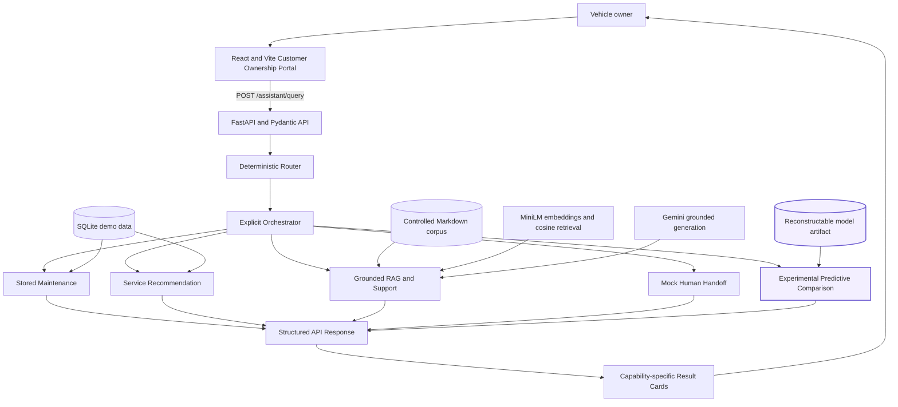
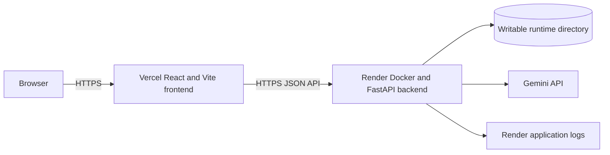

# Final Architecture

## System overview

Agentic Customer Ownership Copilot is an explicit tool-orchestration system, not
an autonomous multi-agent application. A deterministic classifier selects one
known intent, and an orchestrator invokes the corresponding bounded service.
Each service returns a typed result that retains its own meaning and is rendered
by a dedicated frontend component.



The predictive path is **EXPERIMENTAL**. Stored deterministic maintenance is the
authoritative scheduled-service result. No component merges these into a final
or hybrid status.

## Request lifecycle

1. The browser submits a typed assistant request containing a message and only
   the optional context needed by the selected flow.
2. FastAPI validates the body and provides server-owned dependencies such as the
   database session and prepared capability services.
3. The deterministic router normalizes the message and returns one typed intent,
   an unsupported result, or a clarification requirement.
4. The explicit orchestrator checks route-specific context. It never guesses a
   vehicle or predictive feature value.
5. At most one capability executes. Non-selected services are not called.
6. The orchestrator returns a structured result containing routing outcome,
   invoked capability, missing context, and exactly one optional capability
   payload when execution succeeds.
7. The frontend validates the response shape and renders the matching result
   card without recreating backend business logic.

The MVP uses no LLM intent classifier, LLM tool calling, autonomous specialized
agents, LangChain agent, or LangGraph workflow.

## Capability boundaries

### Stored maintenance

```text
SQLite vehicle + latest scheduled service
-> maintenance application service
-> pure distance/time evaluator
-> Not Due | Due Soon | Overdue + metrics/reasons
```

This path is authoritative. Persistence supplies inputs; the pure evaluator owns
the decision.

### Service recommendation

```text
Stored vehicle context + authoritative maintenance + explicit trip context
-> bounded deterministic rules
-> ordered service type + priority + reason + supporting factors
```

Recommendations are demo/MVP preventive guidance, not diagnosis or
manufacturer-authoritative schedules.

### Grounded support

```text
Controlled Markdown documents
-> section-aware chunks
-> local all-MiniLM-L6-v2 embeddings
-> exact cosine-similarity retrieval
-> confidence gate
-> Gemini grounded generation when supported
-> answer + source metadata
```

If the confidence gate rejects the evidence, the service returns a deterministic
fallback with empty sources and does not call Gemini.

### Mock handoff

The service creates an immutable local ticket/reference result from explicit
handoff routing. It has no external CRM, dealer, email, SMS, appointment, or
call-centre side effect.

### Experimental predictive comparison

```text
Eight explicit runtime features
-> fitted StandardScaler + LogisticRegression pipeline
-> 90-day probability and thresholded experimental signal

Same inputs
-> deterministic maintenance evaluator

Both signals
-> four-way relationship only; no final decision
```

The artifact and metadata are ignored generated state. Startup reuses a valid
pair or reconstructs it from frozen synthetic-data, split, and model seeds. The
persisted threshold is `0.19`, the useful-value gate is recorded as failed, and
metadata states that deterministic maintenance remains authoritative.

## Runtime resources

| Resource | Owner | Behavior |
| --- | --- | --- |
| SQLite database | SQLAlchemy application/data layer | Tables created and empty database seeded idempotently at startup |
| Knowledge corpus | RAG pipeline | Three controlled Markdown documents copied into the image |
| MiniLM model | Embedding adapter | Exact model prefetched during Docker build and used locally on CPU |
| Gemini key/model | Backend runtime configuration | Key supplied only as a server secret; used for supported grounded generation |
| Predictive artifact | Experimental artifact service | Reused when valid or reconstructed deterministically when absent |

## Deployment architecture



- **Frontend:** https://ai-powered-customer-ownership-copil.vercel.app/
- **Backend:** https://ai-powered-customer-ownership-copilot.onrender.com/
- **Health:** https://ai-powered-customer-ownership-copilot.onrender.com/health

Vercel serves the static frontend. `VITE_API_BASE_URL` selects the public API
base. Render builds `backend/Dockerfile`, supplies runtime environment variables,
and starts Uvicorn on dynamic `PORT`. `ALLOWED_FRONTEND_ORIGINS` contains exact
browser origins; wildcard CORS and credentials are disabled.

The image runs as a non-root user. `/app/runtime` is writable for the generated
SQLite database and predictive artifact. The application fails startup clearly
if essential bootstrap cannot complete. The `/health` endpoint serves both
platform and Docker health checks.

The development machine had no Docker-compatible local engine. Container build
and runtime behavior were therefore validated by the successful remote Render
build and deployed service, not claimed as local Docker verification.

## Observability and privacy

Request middleware:

- accepts a safe inbound `X-Request-ID` or generates a UUID;
- returns the ID in the response;
- records method, path, status, and monotonic duration;
- records assistant intent, invoked capability, outcome, and missing-context
  presence after successful orchestration;
- records startup, bootstrap, readiness, shutdown, and unexpected failure
  events.

Logs intentionally exclude raw user messages, request bodies, predictive
features, retrieved chunks, generated answers, handoff summaries, database
records, environment values, and secrets. Logs are JSON on the application
logging stream with no external aggregation or distributed tracing by design.

## Trust and product boundaries

- Deterministic maintenance is authoritative.
- Recommendations are deterministic demo rules, not diagnosis or manufacturer
  schedules.
- RAG answers are controlled-corpus and confidence gated; sources are visible.
- Handoff is a local mock, not an operational customer-support integration.
- Predictive ML is secondary, synthetic-data-based, failed its replacement gate,
  and produces no final decision.
- Unsupported and ambiguous requests do not silently execute arbitrary tools.
- The system contains no autonomous agents and no LLM-based routing/tool calling.
